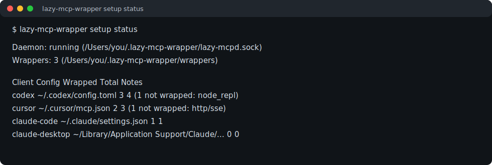

# lazy-mcp-wrapper 中文文档

`lazy-mcp-wrapper` 是一个轻量级 MCP 代理，用来降低本机 AI 客户端的 MCP 常驻内存和启动成本。Codex、Cursor、Claude Code、Claude Desktop 可以先启动 wrapper；真实 MCP 服务只在工具调用真正需要时才启动。

## 快速安装

```bash
brew tap sleticalboy/tap
brew install lazy-mcp-wrapper
lazy-mcp-wrapper setup
```

检查配置结果：

```bash
lazy-mcp-wrapper setup status
```



## 它解决什么问题

- 降低 Context7、Playwright、MasterGo 等 MCP 的空闲内存占用。
- 避免 Codex 等客户端启动时直接拉起所有 stdio MCP 或远程 HTTP MCP 代理链路。
- 缓存 `tools/list`，让客户端发现工具时不必反复启动重型 MCP 进程。
- 通过本地 daemon 让多个 Codex CLI 会话共享无状态 MCP。
- 对 Playwright 这类有状态 MCP 使用 `sharing: "session"`，避免浏览器上下文互相污染。
- 提供 `setup`、`setup status`、`setup update`、`setup uninstall`，配置可检查、可更新、可回滚。

当前支持 stdio MCP 和远程 HTTP MCP。远程 HTTP 默认使用 `streamable-http`；旧版 HTTP+SSE 仅作为兼容模式保留。

适合包装这类 MCP：

- Context7：文档查询类 MCP，平时不需要常驻。
- Playwright MCP：浏览器自动化 MCP，占用相对更高，适合按需启动。
- MasterGo Magic MCP：设计稿读取 MCP，通常只有处理设计稿任务时才需要启动。

不建议包装 `node_repl`。它依赖进程内状态，懒关闭后会丢失 REPL 状态，容易影响浏览器插件和 Node 持久环境相关能力。

## 工作方式

整体链路：

```text
Codex
-> lazy-mcp-wrapper
-> 真实 MCP server
```

Codex 配置中注册的是 `lazy-mcp-wrapper`。wrapper 自己保持很小的常驻进程，并处理 MCP 初始化和工具列表缓存。

当 Codex 请求 `tools/list` 时：

- 如果缓存存在，wrapper 直接返回缓存，不启动真实 MCP。
- 如果缓存不存在，wrapper 会启动真实 MCP，读取工具列表并写入缓存。

当 Codex 请求真实能力时，例如 `tools/call`、`resources/*`、`prompts/*`：

- wrapper 启动真实 MCP。
- 将请求转发给真实 MCP。
- 返回真实 MCP 的结果。
- 空闲超过 `idle_timeout` 后关闭真实 MCP。

## 触发机制

没有固定的“关键词指令”。触发由 Codex 根据任务判断。

常见触发场景：

| MCP | 典型触发任务 |
| --- | --- |
| `context7` | 查询库、框架、SDK、CLI、云服务的官方文档、最新 API、配置方式、版本迁移、报错排查 |
| `playwright` | 打开网页、点击页面、截图、检查本地页面、验证前端交互 |
| `mastergo-magic-mcp` | 读取 MasterGo 设计稿、根据 `fileId` / `layerId` 还原页面、获取设计稿 DSL、SVG、文本 |

示例说法：

```text
查一下 Next.js 最新路由配置
打开本地页面并截图验证
按这个 MasterGo fileId/layerId 还原页面
```

这些说法会增加 Codex 选择对应 MCP 的概率。wrapper 本身不根据中文关键词启动服务，而是根据 Codex 发来的 MCP 方法启动真实服务。

## 构建

```bash
make build
make test
```

构建产物默认输出到：

```text
bin/lazy-mcp-wrapper
```

## 安装

安装到当前用户目录：

```bash
make install
```

等价脚本：

```bash
./scripts/install-local.sh
```

默认安装位置：

```text
~/.local/bin/lazy-mcp-wrapper
```

也可以指定安装前缀：

```bash
PREFIX=/opt/lazy-mcp-wrapper ./scripts/install-local.sh
```

## 配置文件

每个真实 MCP 对应一个 JSON 配置文件。

示例：

```json
{
  "name": "context7",
  "sharing": "shared",
  "command": "npx",
  "args": ["-y", "@upstash/context7-mcp"],
  "real_protocol_version": "2024-11-05",
  "real_framing": "jsonl",
  "cache_dir": "/Users/you/Library/Caches/lazy-mcp-wrapper",
  "idle_timeout": "15s",
  "startup_timeout": "30s",
  "call_timeout": "120s",
  "log_file": "/tmp/lazy-mcp-wrapper-context7.log"
}
```

字段说明：

| 字段 | 说明 |
| --- | --- |
| `name` | MCP 名称，用于日志、缓存 key 和识别 |
| `sharing` | daemon 共享策略，支持 `shared` 和 `session`，默认 `shared` |
| `command` | 启动真实 MCP 的命令 |
| `args` | 启动真实 MCP 的参数 |
| `env` | 可选，传给真实 MCP 的环境变量 |
| `real_protocol_version` | 可选，转发给真实 MCP 的 MCP 协议版本 |
| `real_framing` | wrapper 和真实 MCP 之间的传输帧格式，支持 `header` 和 `jsonl` |
| `cache_dir` | 可选，工具列表缓存目录 |
| `disable_cache` | 可选，设为 `true` 后禁用 `tools/list` 缓存 |
| `idle_timeout` | 真实 MCP 空闲多久后关闭 |
| `startup_timeout` | 启动真实 MCP 的超时时间 |
| `call_timeout` | 单次真实 MCP 调用的超时时间 |
| `log_file` | wrapper 日志文件路径 |

`real_framing` 说明：

- `header`：标准 MCP `Content-Length` 帧格式，默认值。
- `jsonl`：每行一个 JSON-RPC 消息。当前 Context7、Playwright MCP、MasterGo Magic MCP 示例都使用这个模式。

### 远程 HTTP MCP

`lazy-mcp-wrapper` 也可以代理远程 HTTP MCP。推荐协议是 MCP 2025-03-26 标准里的 `streamable-http`：

```json
{
  "name": "my-remote-mcp",
  "url": "https://example.com/mcp",
  "protocol": "streamable-http"
}
```

`protocol` 字段支持：

| 值 | 说明 |
| --- | --- |
| `streamable-http` | 推荐值。MCP 2025-03-26 标准；省略 `protocol` 时默认使用它。 |
| `sse` | 已废弃的旧版 HTTP+SSE 传输，仅用于兼容旧服务。 |

`setup` 包装远程 HTTP MCP 时，会通过共享 daemon 启动本地 HTTP proxy，并把客户端配置改写到类似 `http://127.0.0.1:54300` 的本地地址。端口会从 `54300` 开始自动递增分配，并写入生成的 wrapper config 的 `local_port` 字段。

## Codex 配置

Codex 中不要直接配置真实 MCP，而是配置 wrapper。

示例：

```toml
[mcp_servers.context7]
type = "stdio"
command = "/Users/binlee/.local/bin/lazy-mcp-wrapper"
args = ["--config", "/Users/binlee/code/open-source/lazy-mcp-wrapper/examples/context7.json"]
```

Playwright 示例：

```toml
[mcp_servers.playwright]
type = "stdio"
command = "/Users/binlee/.local/bin/lazy-mcp-wrapper"
args = ["--config", "/Users/binlee/code/open-source/lazy-mcp-wrapper/examples/playwright.json"]
```

MasterGo 示例：

```toml
[mcp_servers.mastergo-magic-mcp]
type = "stdio"
command = "/Users/binlee/.local/bin/lazy-mcp-wrapper"
args = ["--config", "/Users/binlee/code/open-source/lazy-mcp-wrapper/configs.local/mastergo-magic-mcp.json"]
```

修改 Codex 配置后，需要重启 Codex 或打开新的 Codex 会话。现有会话通常不会热加载 MCP 配置。

## 共享 Daemon 模式

普通 wrapper 模式下，每个 Codex CLI 会话都会启动一套 wrapper。真实 MCP 仍然按需启动，但 wrapper 进程和运行态状态会按会话重复。

共享 daemon 模式用于让多个 Codex CLI 共享同一个本机 MCP 管理进程：

```text
多个 Codex CLI
-> 各自启动很薄的 client wrapper
-> 连接同一个 lazy-mcp-wrapper daemon
-> daemon 统一按需启动真实 MCP
```

共享 daemon 当前支持两类策略：

- `shared`：适合无状态或只读 MCP，例如 `context7`、`mastergo-magic-mcp`。
- `session`：适合有会话状态的 MCP，例如 `playwright`。多个 Codex 会话共享 daemon 入口，但每个 client connection 单独启动真实 MCP，避免浏览器页面、登录态和上下文互相污染。

启动 daemon：

```bash
lazy-mcp-wrapper daemon \
  --socket /Users/binlee/.lazy-mcp-wrapper/lazy-mcpd.sock \
  --config /Users/binlee/code/open-source/lazy-mcp-wrapper/examples/context7.json \
  --config /Users/binlee/code/open-source/lazy-mcp-wrapper/configs.local/mastergo-magic-mcp.json
```

也可以使用 daemon 配置文件：

```json
{
  "socket": "/Users/binlee/.lazy-mcp-wrapper/lazy-mcpd.sock",
  "configs": [
    "/Users/binlee/code/open-source/lazy-mcp-wrapper/examples/context7.json",
    "/Users/binlee/code/open-source/lazy-mcp-wrapper/examples/playwright.json",
    "/Users/binlee/code/open-source/lazy-mcp-wrapper/configs.local/mastergo-magic-mcp.json"
  ]
}
```

启动命令：

```bash
lazy-mcp-wrapper daemon --daemon-config /Users/binlee/.lazy-mcp-wrapper/config.json
```

Codex 中的 client 配置：

```toml
[mcp_servers.context7]
type = "stdio"
command = "/Users/binlee/.local/bin/lazy-mcp-wrapper"
args = ["client", "--socket", "/Users/binlee/.lazy-mcp-wrapper/lazy-mcpd.sock", "--name", "context7"]

[mcp_servers.mastergo-magic-mcp]
type = "stdio"
command = "/Users/binlee/.local/bin/lazy-mcp-wrapper"
args = ["client", "--socket", "/Users/binlee/.lazy-mcp-wrapper/lazy-mcpd.sock", "--name", "mastergo-magic-mcp"]

[mcp_servers.playwright]
type = "stdio"
command = "/Users/binlee/.local/bin/lazy-mcp-wrapper"
args = ["client", "--socket", "/Users/binlee/.lazy-mcp-wrapper/lazy-mcpd.sock", "--name", "playwright"]
```

当前 daemon 不会自动后台启动。如果 Codex client 连接不到 daemon，会直接报错退出，避免静默 fallback 导致排查困难。

如果要把 daemon 交给 macOS 用户级 LaunchAgent 管理：

```bash
make install-agent
```

卸载：

```bash
make uninstall-agent
```

默认 LaunchAgent 信息：

```text
label:  com.binlee.lazy-mcp-wrapper
plist:  ~/Library/LaunchAgents/com.binlee.lazy-mcp-wrapper.plist
config: ~/.lazy-mcp-wrapper/config.json
socket: ~/.lazy-mcp-wrapper/lazy-mcpd.sock
logs:   ~/Library/Logs/lazy-mcp-wrapper
```

安装脚本会把当前 `PATH` 写进 plist，确保 daemon 能找到 `npx`。

也可以使用自动化 setup 一次性扫描并配置 Codex、Cursor、Claude Code 和 Claude Desktop：

```bash
lazy-mcp-wrapper setup --dry-run
lazy-mcp-wrapper setup
lazy-mcp-wrapper setup --yes
```

`setup` 会生成 wrapper config、daemon config、LaunchAgent plist，并备份后更新各 client 的 MCP 配置。它会包装 stdio MCP 和远程 HTTP MCP，`node_repl` 会跳过，Playwright 会自动使用 `sharing: "session"`。远程 HTTP MCP 会通过 daemon 管理的本地 HTTP proxy 端口暴露给客户端。

daemon 控制命令：

```bash
lazy-mcp-wrapper status --socket ~/.lazy-mcp-wrapper/lazy-mcpd.sock
lazy-mcp-wrapper status --socket ~/.lazy-mcp-wrapper/lazy-mcpd.sock --format table
lazy-mcp-wrapper stop --socket ~/.lazy-mcp-wrapper/lazy-mcpd.sock
lazy-mcp-wrapper reload --socket ~/.lazy-mcp-wrapper/lazy-mcpd.sock
lazy-mcp-wrapper reload --socket ~/.lazy-mcp-wrapper/lazy-mcpd.sock --graceful
lazy-mcp-wrapper reload --socket ~/.lazy-mcp-wrapper/lazy-mcpd.sock --force
```

`status` 会输出 daemon 配置路径、daemon pid、启动时间、运行时长、当前 client 数、活跃 client session、已转发调用数、最近错误和各 MCP 运行状态。

每个 MCP 的状态会包含请求数、错误数、最近一次方法、最近一次错误、最近一次 reload 时间和延迟统计。

`stop` 会请求 daemon 退出。如果使用 LaunchAgent 管理，launchd 会按配置重新拉起。

`reload` 只支持通过 `--daemon-config` 启动的 daemon，会重新读取 daemon 配置文件并替换 MCP 代理。手动 `daemon --config ...` 模式没有可重载源，会返回明确错误。默认情况下，如果存在活跃 client，reload 会返回 busy；使用 `--graceful` 会让新 client 使用新代理，旧 client 继续使用旧代理直到断开；使用 `--force` 会立即强制替换代理并关闭旧真实 MCP 进程。

## 缓存

`tools/list` 默认启用缓存。缓存位置默认在系统用户缓存目录下，也可以通过 `cache_dir` 指定。

查看配置和缓存状态：

```bash
lazy-mcp-wrapper --config ./examples/context7.json --inspect
```

查看 shared daemon 运行状态：

```bash
lazy-mcp-wrapper status --socket ~/.lazy-mcp-wrapper/lazy-mcpd.sock
```

输出会包含 daemon 配置路径、daemon pid、启动时间、运行时长、当前 client 数、活跃 client session、已转发调用数、最近错误、已注册 MCP、真实 MCP 是否已经启动、真实进程 pid、最近使用时间、MCP 请求数、错误数、最近方法、最近错误和延迟统计。

刷新缓存：

```bash
lazy-mcp-wrapper --config ./examples/context7.json --refresh-cache
```

清理缓存：

```bash
lazy-mcp-wrapper --config ./examples/context7.json --clear-cache
```

如果配置了 `disable_cache: true`，每次 `tools/list` 都会访问真实 MCP。

## 日志

wrapper 的日志写入配置中的 `log_file`，例如：

```bash
tail -f /tmp/lazy-mcp-wrapper-context7.log
tail -f /tmp/lazy-mcp-wrapper-playwright.log
tail -f /tmp/lazy-mcp-wrapper-mastergo.log
```

stdout 会保留给 MCP 协议帧使用，不应该输出普通日志。

## 验证

运行单元测试和集成测试：

```bash
GOCACHE=/private/tmp/lazy-mcp-wrapper-gocache go test ./...
```

运行本地 smoke：

```bash
./scripts/smoke.sh
```

运行 shared daemon smoke：

```bash
make smoke-shared-daemon
```

手动 smoke 某个真实 MCP：

```bash
go build -o bin/lazy-mcp-wrapper ./cmd/lazy-mcp-wrapper
go run ./cmd/mcp-smoke ./bin/lazy-mcp-wrapper ./examples/context7.json
```

调用真实工具验证转发：

```bash
go run ./cmd/mcp-smoke \
  --call-tool resolve-library-id \
  --call-args '{"query":"Go gin web framework routing middleware","libraryName":"Gin"}' \
  ./bin/lazy-mcp-wrapper ./examples/context7.json
```

## MasterGo 私有配置

仓库中的 `examples/mastergo-magic-mcp.json` 不包含真实 token，只保留占位符：

```text
${MASTERGO_TOKEN}
```

本地真实配置应该放在：

```text
configs.local/mastergo-magic-mcp.json
```

`configs.local/` 不应该提交到 git。wrapper 的 `--inspect` 输出会对 token 参数做脱敏处理。

## 常见问题

### Codex 为什么没有立刻生效？

修改 `~/.codex/config.toml` 后，需要重启 Codex 或开启新会话。当前会话一般不会重新读取 MCP 配置。

### 为什么第一次调用会慢一点？

第一次真实调用需要启动底层 MCP。后续调用如果真实 MCP 还没因为空闲超时退出，会复用同一个真实进程。

### 为什么只查工具列表没有启动真实 MCP？

这是预期行为。`tools/list` 命中缓存时，wrapper 会直接返回缓存，避免启动真实 MCP。

### 如何确认真实 MCP 是否启动过？

查看对应日志文件：

```bash
tail -f /tmp/lazy-mcp-wrapper-context7.log
```

日志里会出现真实 MCP 启动、调用、响应、空闲退出等信息。

### 真实 MCP 不响应怎么办？

先看 `log_file`。如果直接启动真实 MCP 都没有响应，通常说明上游 MCP 命令没有进入 stdio server 模式，或者需要调整 `real_framing`。

### 什么时候用 `jsonl`，什么时候用 `header`？

默认使用 `header`。如果上游 MCP 实际是一行一个 JSON-RPC 消息，就用 `jsonl`。当前示例里的 Context7、Playwright、MasterGo 使用的是 `jsonl`。

## 回滚

如果 Codex 切换后需要回滚，恢复原来的 `~/.codex/config.toml` 备份即可：

```bash
cp /path/to/config.toml.bak ~/.codex/config.toml
```

然后重启 Codex 或开启新会话。
